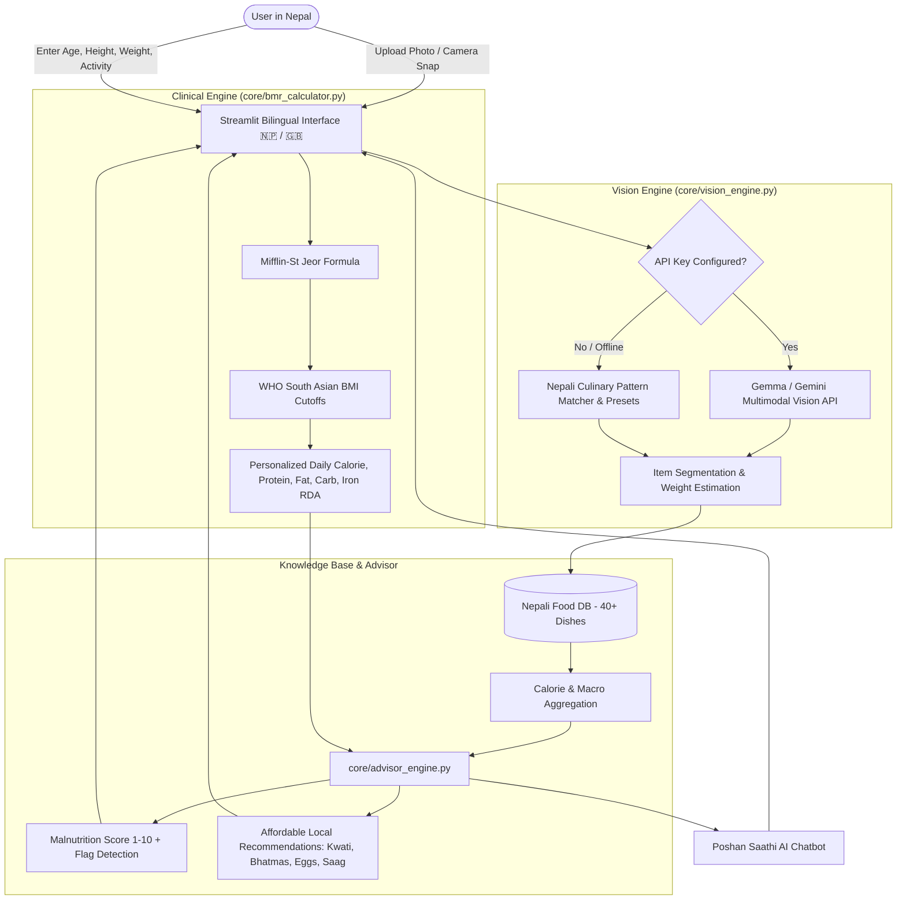

# 🍲 PoshanAI (पोषण AI)
### Open-Source Nepali Nutrition & Malnutrition Advisory Platform
*A Community-Driven Open-Source AI Project for Hacktoberfest 2026 | Dedicated to UN SDG-3: Good Health & Well-being*

[](https://hacktoberfest.com)
[](https://www.python.org/)
[](https://opensource.org/licenses/MIT)
[](https://streamlit.io)
[](https://ai.google.dev/gemma)
[]()

---

## 🏔️ The Mission & Problem Statement

In Nepal, malnutrition remains a silent public health crisis:
- **Child Stunting & Wasting**: Significant proportions of children under 5 suffer from chronic malnutrition and protein-energy malnutrition (PEM).
- **Maternal Anemia**: Nutritional iron-deficiency anemia affects over 40% of women and young children.
- **The Carbohydrate Trap**: Traditional staple meals often consist of 75–85% white rice (*Bhat*) with minimal lentil (*Dal*) or protein density, causing micronutrient and protein deficiencies despite high caloric intake.
- **Language & Cultural Barriers**: Most global calorie-tracking apps (MyFitnessPal, LoseIt) only recognize Western dishes and fail completely on Nepali meals like *Dal Bhat Tarkari*, *Kodo ko Dhindo*, *Gundruk Bhatmas*, *Kwati*, or *Sel Roti*.

**PoshanAI (पोषण AI)** solves this with a culturally aware, bilingual AI platform that:
1. Automatically recognizes and quantifies Nepali foods from uploaded photos or camera snapshots using **Gemma & Multimodal AI**.
2. Calculates clinical **BMR (Basal Metabolic Rate)** and **TDEE (Total Daily Energy Expenditure)** using the Mifflin-St Jeor formula and **WHO South Asian BMI cutoffs**.
3. Assesses the nutritional balance of the meal against the user's daily metabolic needs and flags malnutrition risks (e.g. low protein, anemia risk, carbohydrate excess).
4. Recommends **affordable, locally accessible Nepali superfoods** (Kwati, roasted Bhatmas, boiled eggs, Gundruk, green Saag) instead of expensive foreign supplements.
5. Operates in **native Nepali (नेपाली)** and English, ensuring maximum grassroots accessibility.

---

## ✨ Key Features

| Feature | Description |
| :--- | :--- |
| **📸 Multimodal Food Scanner** | Recognizes multi-item Nepali thalis and individual dishes using Gemma / Gemini vision with portion weight estimation. |
| **⚙️ Zero-Cost Offline Fallback** | Works 100% offline with a built-in Nepali Food Knowledge Base even without internet or API keys—zero demo crashes! |
| **🩺 Clinical BMR & TDEE Engine** | Computes resting metabolic rate, South Asian BMI categories, and target macro splits tailored to age, sex, and activity. |
| **🇳🇵 40+ Authentic Foods DB** | Curated nutritional composition based on the *Food Composition Table for Nepal* (Government of Nepal DFTQC). |
| **💬 Poshan Saathi (पोषण साथी)** | Interactive bilingual AI nutrition assistant that answers dietary questions and provides culturally grounded advice. |
| **⚖️ Malnutrition Early Warning** | Real-time screening for protein deficiency, calorie surplus/deficit, and iron/micronutrient gaps. |

---

## 🏗️ System Architecture



---

## 🚀 Quickstart Guide

### Prerequisites
- Python 3.11+
- [uv](https://github.com/astral-sh/uv) (recommended) or standard `pip`

### 1. Clone & Setup
```bash
git clone https://github.com/your-username/poshan-ai.git
cd poshan-ai
```

### 2. Install Dependencies (via uv)
```bash
# Using uv (fastest)
uv sync

# Or using standard pip
pip install -r requirements.txt
```

### 3. (Optional) Configure API Key
PoshanAI works **completely offline with zero configuration**! To enable live cloud multimodal vision:
```bash
cp .env.example .env
# Edit .env and insert your free Google AI Studio key:
# GEMINI_API_KEY=your_free_key_here
```

### 4. Run the Application
```bash
# Launch FastAPI server (opens at http://localhost:8000)
uv run python server.py
```
Open your browser at **`http://localhost:8000`**.

---

## 🧪 Running Automated Tests

We maintain comprehensive automated tests covering clinical BMR formulas, database queries, vision fallbacks, REST APIs, and malnutrition screening rules:

```bash
uv run pytest
```
*Current test suite: 19/19 passing tests.*


---

## 🤝 Contributing to Hacktoberfest

We warmly welcome Hacktoberfest contributors from Nepal and across the globe!

Ways you can contribute:
1. **Add new Nepali regional dishes**: Expand `data/nepali_foods.json` with authentic dishes from Newari, Tharu, Sherpa, Mithila, or Kirat culinary traditions.
2. **Translate into local languages**: Help add Maithili, Bhojpuri, or Nepal Bhasa translations.
3. **Enhance vision prompts**: Improve portion size estimation algorithms.
4. **Documentation**: Add recipe tutorials and nutritional comparisons.

Please read [CONTRIBUTING.md](CONTRIBUTING.md) for full guidelines.

---

## 📄 License & Acknowledgements

- **License**: [MIT License](LICENSE)
- **Data Source**: Government of Nepal, Ministry of Agriculture and Livestock Development, Department of Food Technology and Quality Control (DFTQC) - *Food Composition Table for Nepal*.
- **Guidelines**: World Health Organization (WHO) South Asian BMI cutoffs and UNICEF Nepal Malnutrition Indicators.

*Developed with ❤️ for the health and prosperity of Nepal.*
